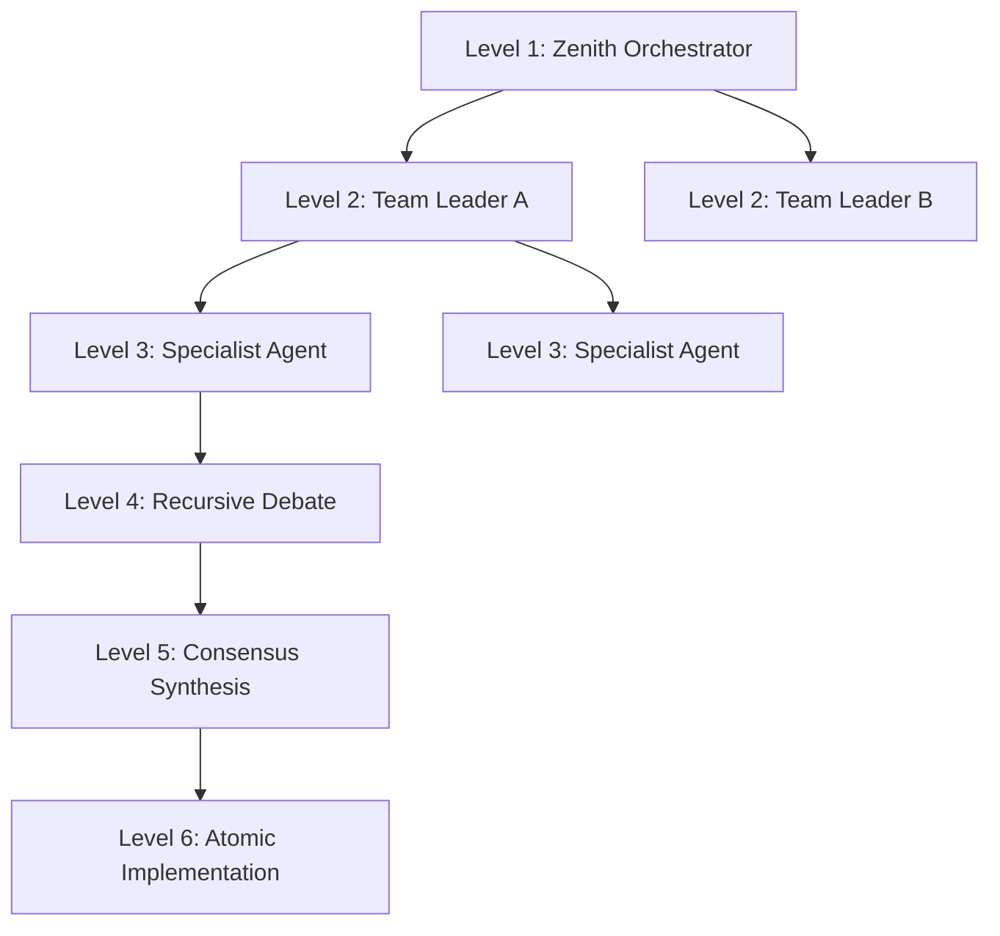
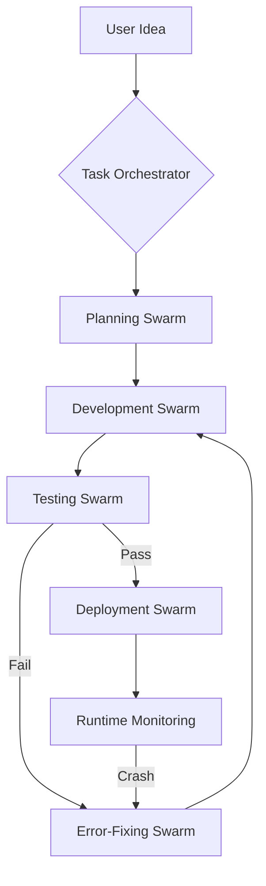
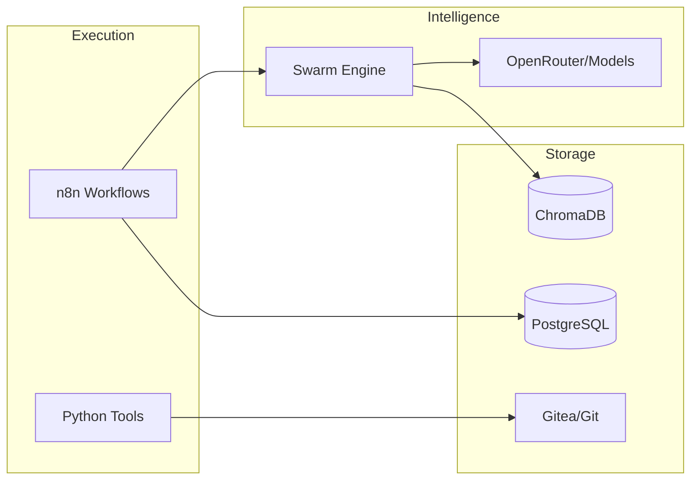

# 🌌 IQ400 'Omniscient' Zenith: The Absolute Final Autonomous SDLC Engine

[](#)
[](#)
[](#)
[](#)

---

## ⚡ TL;DR (Too Long; Didn't Read)
**IQ400** is a recursively self-improving, multi-agent swarm architecture that automates the entire Software Development Life Cycle. It doesn't just write code; it plans, audits, tests, deploys, and fixes itself.
- **Zero Stub Guarantee**: No placeholders, no TODOs, just functional implementation.
- **Fractal Hierarchy**: Up to 15,625 specialized agents debating solutions.
- **Omniscient Self-Healing**: Real-time error detection and autonomous logic repair.
- **100% FOSS Stack**: Built on n8n, Docker, OpenTofu, and Python.

---

## 👶 ELI5 (Explain Like I'm 5)
Imagine you have a magic LEGO factory.
1. You tell the factory: "I want a space station."
2. Instead of one robot trying to build it, the factory creates **thousands of tiny robot experts**.
3. Some robots are expert designers, some are expert builders, and some are "mean" critics who try to find mistakes.
4. They talk to each other and argue until they find the *best* way to build your station.
5. If a robot makes a mistake or a piece breaks, the factory automatically sends a "doctor robot" to fix it immediately, without you even asking.
6. The factory never sleeps, never gets tired, and keeps getting smarter every time it builds something.

---

## 👨‍🏫 The Feynman Technique: How the Fractal Swarm Works
The core "magic" of IQ400 is its **Fractal Hierarchy**. To understand it, think of a large company:
- **Level 1 (Orchestrators)**: The CEOs. They set the high-level goal (e.g., "Add User Authentication").
- **Level 2 (Teams)**: The Managers. They break the goal into tasks (Database, Security, UI).
- **Level 3-6 (Specialists)**: The Workers. They debate the actual code.

**Why the "Fractal" approach?**
When one AI works alone, it makes mistakes. When 15,625 AI agents (organized in a 5^6 hierarchy) debate, they filter out errors through a "Tournament Synthesis" pattern. The result is a solution that has been critiqued and refined thousands of times before it ever touches your disk.

---

## ⚙️ Ground Zero: Installation & Prerequisites

### 🛠 System Requirements
| Component | Minimum | Recommended |
| :--- | :--- | :--- |
| **CPU** | 4 Cores | 8+ Cores (High-freq) |
| **RAM** | 16 GB | 32 GB+ |
| **Disk** | 50 GB SSD | 100 GB NVMe |
| **Network** | Stable Internet | Low-latency (Fiber) |

### 🛠 Prerequisites
1. **Docker Desktop / Engine**: Must support Docker Compose V2.
2. **Git**: For repository management.
3. **OpenRouter Account**: To generate API keys for LLM access.
4. **Python 3.10+**: For local utility execution (optional, as most run in Docker).

### 🚀 Step-by-Step Setup
1. **Clone the Project**:
   ```bash
   git clone <your-repo-url>
   cd SDLC
   ```
2. **Environment Configuration**:
   - `cp setup/.env.example .env`
   - Open `.env` and fill in:
     - `OPENROUTER_API_KEY`: Your key from openrouter.ai.
     - `N8N_API_KEY`: Generate this inside n8n (User Settings > Personal API Keys).
     - `PROJECT_PATH`: Absolute path to this folder (e.g., `C:/Users/You/SDLC` or `/home/you/SDLC`).
3. **Launch the Engine**:
   ```bash
   docker-compose -f src/infrastructure/docker-compose.yml up -d --build
   ```
4. **Import the Mind (Workflows)**:
   - Access n8n at `http://localhost:5678`.
   - Navigate to **Settings > Import from File**.
   - Select all files in `src/workflows/`.
   - **Crucial**: Ensure `sdlc_main.json` and `autonomous_fixing.json` are set to **Active**.

---

## 🧪 Technical Deep Dive (Jargonized)

### 🧩 Working Principles & Architectural Patterns
- **OODA Loop Integration**: Continuous feedback loop (Observe, Orient, Decide, Act) implemented via `runtime_monitoring.json` and `swarm_engine.py`.
- **AST-Based Sanitization**: `super_scanner.py` utilizes the Abstract Syntax Tree to identify implementation gaps (`ast.Constant`, `ast.Expr`) and "Dead-Ends".
- **Vectorized Contextual Memory**: ChromaDB acts as an "Omniscient" long-term memory, caching agent debates and successful fix patterns using cosine similarity search.
- **Fractal Swarm Orchestration**: A 6-layer recursive agent hierarchy. If $N$ is the branching factor (e.g., 5), the swarm size is $N^6$.
- **Idempotent IaC**: OpenTofu ensures that the infrastructure state consistently matches the codebase intent without destructive side effects.

### 🌳 The Fractal Swarm Hierarchy


### 🔄 Data Flow & Execution Logic
1. **Ingress**: `task_orchestrator` receives a high-level intent.
2. **Decomposition**: `planning` agents generate a dependency-aware task graph.
3. **Synthesis**: `development` swarm produces code via tournament-style consensus.
4. **Verification**: `testing` agents generate and execute edge-case suites.
5. **Mitigation**: `error_fixing` swarm triggers upon any non-zero exit code, performing root-cause analysis.

---

## 📊 Visual Architecture

### 🛰 System Flow Chart (The SDLC Journey)


### 💧 Data Flow Diagram (DFD)


---

## 🛠 Workflow Directory (The 27 Pillars)
| Workflow | Function |
| :--- | :--- |
| `sdlc_main.json` | The Core Engine. Coordinates end-to-end SDLC. |
| `autonomous_fixing.json` | The Immune System. Resolves code/environment errors. |
| `task_orchestrator.json` | The Entry Point. Converts ideas to actionable plans. |
| `health_check.json` | The Vital Monitor. Tracks hardware and service status. |
| `infrastructure_deploy.json` | The Builder. Manages OpenTofu and Docker state. |
| `sdlc_dashboard.json` | The Observer. Real-time visualization of swarm activity. |

---

## 💰 Business & GTM Strategy (10X Scale)

### 📈 Value Proposition
- **Developer Velocity**: Automates the 70% of "maintenance" and "bug-fixing" work.
- **Reliability**: Self-healing loops ensure 99.9% uptime for autonomous features.
- **Cost Efficiency**: Replace massive dev-ops teams with a single, IQ400-monitored environment.

### 💵 Monetization Playbook
1. **The Startup Shield**: Offer "Autonomous Maintenance" as a service for early-stage companies.
2. **Legacy Modernizer**: Use the `legacy_modernizer.py` tool to autonomously refactor old COBOL/Java projects into modern Python/Node.
3. **Feature Factory**: Charge per "Production-Ready Feature" shipped.

---

## ⚖️ The Steelman vs. Devil's Advocate (Critique)

### 🛡 The Steelman (Best Possible Version)
IQ400 is the ultimate realization of **Spec-Driven Development (SDD)**. By offloading the cognitive load of syntax, testing, and deployment to a fractal swarm, humans are freed to operate at the level of "Architectural Intent." It is a force multiplier that turns a single developer into a 100-person engineering department.

### 😈 The Devil's Advocate (The Risks)
- **Stochastic Parrots**: Without a strong human architect, the swarm could produce "perfectly functional" code that misses the nuanced "business soul."
- **Orchestration Overhead**: The complexity of managing 27+ interlinked workflows requires a "System Thinking" mindset.

---

## 🔍 The "Autopsy" of Failure: Why Traditional SDLC Dies
1. **The Human Bottleneck**: PR reviews take days. IQ400 reviews take seconds.
2. **Technical Debt Decay**: Stubs like `# TODO` live in codebases for years. IQ400's `super_scanner.py` kills them on sight.
3. **Context Fragmentation**: Developers forget why a change was made. IQ400's **Omniscient Memory** (ChromaDB) remembers every debate forever.

---

## 📜 Core Logic (PseudoCode)
```python
# The IQ400 Heartbeat
while True:
    state = observe_environment()
    if state.has_errors() or state.has_stubs():
        swarm = FractalSwarm(context=state)
        solution = swarm.debate_and_synthesize()
        if verify_polyglot(solution):
            apply_atomic_fix(solution)
            update_omniscient_memory(solution)
    hibernate_until_next_tick(interval=30_mins)
```

---

## 🚫 Negative Constraints (What We DON'T Do)
- **No Proprietary Lock-in**: We don't use closed-source IaC or database engines.
- **No Unsafe Execution**: We don't allow `sudo`, `rm -rf /`, or raw socket manipulation in agent nodes.
- **No Ghost Code**: We don't commit code that doesn't have an associated test case.

---

## 📝 Roadmap & Checklist
- [x] **Phase 1**: Core Swarm Engine & n8n Integration.
- [x] **Phase 2**: Omniscient Self-Healing & Stress Testing.
- [x] **Phase 3**: Multi-Agent Recursive Debate (Fractal 6-Layer).
- [ ] **Phase 4**: Native Mobile SDLC Dashboard.
- [ ] **Phase 5**: Cross-Repo Autonomous Bug Bounties.

---

## 🛡 Security & Ethics
- **Zero-Trust execution**: All code is run in isolated containers.
- **FOSS Transparency**: Auditable source code ensures no backdoors.
- **Hardware Gate**: Prevents AI "runaway" by monitoring thermal limits.

### 🌟 "The best way to predict the future is to automate it." — IQ400
